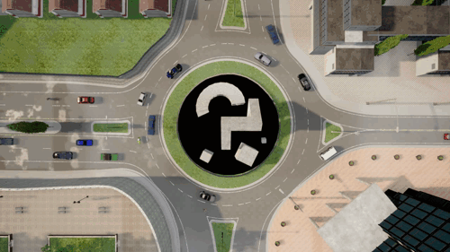

[pypi-badge]: https://badge.fury.io/py/invertedai.svg
[pypi-link]: https://pypi.org/project/invertedai/


[](https://inverted-ai.readthedocs.io/en/latest/?badge=latest)
[![PyPI][pypi-badge]][pypi-link]

# InvertedAI
## Overview
<!-- start elevator-pitch -->
Inverted AI has trained cutting-edge realistic behavioral driving models that are human-like and close the SIM2Real. Our API provides access to these behavioral models and can be useful for several tasks in autonomous vehicle (AV) research and development.


<!-- end elevator-pitch -->

# Get Started
<!-- start quickstart -->
In this quickstart tutorial, you’ll run a simple sample AV simulation with Inverted AI Python API. Along the way, you’ll learn key concepts and techniques that are fundamental to using the API for other tasks. In particular, you will be familiar with two main Inverted AI models:

- DRIVE
- INITIALIZE

## Quick Start
- **Goolge Colab***: [](https://colab.research.google.com/github/inverted-ai/invertedai-drive/blob/develop/examples/Colab-Demo.ipynb)

- **Locally**: Download the 
<a href="https://minhaskamal.github.io/DownGit/#/home?url=https://github.com/inverted-ai/invertedai/tree/master/examples" target="_blank">examples directory</a>, navigate to the unzipped directory in terminal and run 

```
python3 -m venv .venv
source .venv/bin/activate
pip install --upgrade pip
pip install -r requirements.txt
.venv/bin/jupyter notebook Drive-Demo.ipynb
```

## Installation

[pypi-badge]: https://badge.fury.io/py/invertedai.svg
[pypi-link]: https://pypi.org/project/invertedai/

To install use [![PyPI][pypi-badge]][pypi-link]:

```bash
pip install invertedai
```

## Setting up

Import the _invertedai_ package and set the API key with **add_apikey** method.

Refer to the [product page](https://www.inverted.ai) to get your API key (or recharge for more tokens).

```python

import invertedai as iai
iai.add_apikey("XXXXXXXXXXXXXX")
```

## Browse through available maps (location)
Inverted AI provides an assortment of diverse road configurations and geometries, including real-world locations and maps from simulators (CARLA, Huawei SMARTS, ...).\
To search the catalog use **iai.available_maps** method by providing keywords
```python
iai.available_maps("roundabout", "carla")
```

To get information about a scene use **iai.get_map**.
```python
iai.get_map**("CARLA:Town03:Roundabout")
```
The scene information include the map in [Lanelet2](https://github.com/fzi-forschungszentrum-informatik/Lanelet2) format, map in JPEG format, maximum number of allowed (driveable) vehicles, latitude longitude coordinates (for real-world locations), id and list of traffic light and signs (if any exist in the map), etc.

## INITIALIZE
To run the simulation, the map must be first populated with agents.
Inverted AI provides the **INITIALIZE**, a state-of-the-art model trained with real-life driving scenarios which can generate realistic positions for the initial state of the simulation.\
Having realistic, complicated and diverse initial conditions are particularly crucial to observer interesting and informative interaction between the agents, i.e., the ego vehicle and NPCs (non-player characters).

You can use **INITIALIZE** in two modes:
- _Initialize all agents_: generates initial conditions (position and speed) for all the agents including the ego vehicle
```python
response = iai.initialize(
    location="CARLA:Town03:Roundabout",
    agent_count=10,
)
```
- _Initialize NPCs_: generates initial conditions (position and speed) only for the NPCs according to the provided state of the ego vehicle.
```python
response = iai.initialize(
    location="CARLA:Town03:Roundabout",
    agent_count=10,
)
```
> _response_ is a dictionary of _states_, and _agent-attribute_  (_recurrent-states_ is also returned for compatibility with **drive**)\
> _response["states"]_ is a list of agent states, by default the first on the list is always the ego vehicle.

## DRIVE
{py:func}`invertedai.api_resources.drive` **DRIVE** is Inverted AI's cutting-edge realistic driving model trained on millions of miles of traffic data.
This model can drive all the agents with only the current state of the environment, i.e., one step observations (which could be obtained from **INITIALIZE**) or with multiple past observations.
```python
response = iai.drive(
    location="CARLA:Town03:Roundabout",
    agent_attributes=response["attributes"],
    states=response["states"],
    recurrent_states=response["recurrent_states"],
    traffic_states_id=response["traffic_states_id"],
    steps=1,
    get_birdviews=True,
    get_infractions=True,
)
```
>For convenience and to reduce data overhead, ***drive** also returns _recurrent-states_ which can be feedbacked to the model instead of providing all the past observations.\
>Furthermore, **drive** drive all the agents for $steps\times \frac{1}{FPS}$ where by default $FPS=10[frames/sec]$, should you require other time resolutions [contact us](mailto:info@inverted.ai).

<!-- end quickstart -->
