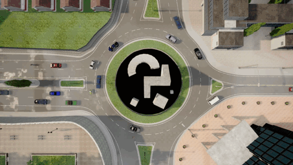

[pypi-badge]: https://badge.fury.io/py/invertedai.svg
[pypi-link]: https://pypi.org/project/invertedai/
[python-badge]: https://img.shields.io/pypi/pyversions/invertedai.svg?color=%2334D058
[ci-badge]: https://github.com/inverted-ai/invertedai/actions/workflows/CI.yml/badge.svg?branch=master
[colab-badge]: https://colab.research.google.com/assets/colab-badge.svg
[colab-link]: https://colab.research.google.com/github/inverted-ai/invertedai/blob/develop/examples/IAI_full_demo.ipynb
[rest-link]: https://app.swaggerhub.com/apis-docs/InvertedAI/InvertedAI
[examples-link]: https://github.com/inverted-ai/invertedai/tree/master/examples

[](https://inverted-ai.readthedocs.io/en/latest/?badge=latest)
[![PyPI][pypi-badge]][pypi-link]
[![python-badge]][pypi-link]
[![ci-badge]](https://github.com/inverted-ai/invertedai/actions/workflows/CI.yml)
[![Open In Colab][colab-badge]][colab-link]

# InvertedAI

## Overview
<!-- start elevator-pitch -->
Inverted AI provides an API for controlling non-playable characters (NPCs) in autonomous driving simulations,
available as either a [REST API][rest-link] or a [Python SDK](https://docs.inverted.ai/en/latest/pythonapi/index.html), (and [C++ SDK](https://docs.inverted.ai/en/latest/cppapi/index.html)) built on top of it. Using the API requires an access key -
create an account on our [user portal](https://www.inverted.ai/portal/login) to get one.  New users are given keys preloaded with an API access budget; researcher users affiliated to academic institutions generally receive a sufficient amount of credits to conduct their research for free.  This page describes how to get started quickly. For more in-depth understanding,
see the [API usage guide](https://docs.inverted.ai/en/latest/userguide.html), and detailed documentation for the [REST API][rest-link],
the [Python SDK](https://docs.inverted.ai/en/latest/pythonapi/index.html), and the [C++ SDK](https://docs.inverted.ai/en/latest/cppapi/index.html).
To understand the underlying technology and why it's necessary for autonomous driving simulations, visit the
[Inverted AI website](https://www.inverted.ai/).
<!-- end elevator-pitch -->



# Getting started
<!-- start quickstart -->
## Installation
For installing the Python package from [PyPI][pypi-link]:

```bash
pip install --upgrade invertedai
```

The Python client SDK is [open source](https://github.com/inverted-ai/invertedai),
so you can also download it and build locally.

To make calls through the Inverted AI API end points, an API key must be obtained and set (please go to [our website](https://www.inverted.ai/home) to sign up and receive your API key). 

To set this API key in the python SDK, there are 2 methods. The first method is to explicitly set the API key string within a python script using the below function:
``` python
iai.add_apikey('<INSERT_KEY_HERE>')
```
The second method is to set the following environment variable with your API key string via the appropriate method according to your relevant operating system:
```bash
export IAI_API_KEY="<INSERT_KEY_HERE>"
```

To set the API key in the C++ SDK, please review the executables in the examples folder.

## Minimal example

``` python
import invertedai as iai
from invertedai import AgentType
from invertedai import WaypointManagerConfig
from invertedai import SimulationManager
from invertedai import ScenePlotterConfig
from invertedai import LogWriterConfig
import matplotlib.pyplot as plt
import os


LOCATION = "carla:Town10HD"
NUM_AGENTS = 4 # number of agents initialized
SIM_LENGTH=150 # number of timesteps

api_key = os.environ.get("IAI_API_KEY", None)
if api_key is None:
    iai.add_apikey("<INSERT_KEY_HERE>")

print("Begin initialization.")
location_info_response = iai.location_info(location=LOCATION, include_map_source=True)
scene_plotter_cfg = ScenePlotterConfig(location=LOCATION, location_info_response=location_info_response)
waypoint_cfg = WaypointManagerConfig(lanelet_map = location_info_response.get_lanelet_map())
log_cfg = LogWriterConfig(log_path="keyed_minimal_example_log.json",location=LOCATION, location_info_response=location_info_response)
simulation_manager = SimulationManager(scene_plotter_cfg=scene_plotter_cfg, waypoint_cfg=waypoint_cfg, log_writer_cfg=log_cfg)
regions = iai.get_regions_default(agent_count_dict = {AgentType.car: NUM_AGENTS}, location = LOCATION)
response = simulation_manager.initialize(location=LOCATION, regions=regions)
print("initialized agents with ids ", simulation_manager.get_agent_ids())
rendered_static_map = location_info_response.birdview_image.decode()

print("Begin stepping through simulation.")
for step in range(SIM_LENGTH):
    response = simulation_manager.drive(location=LOCATION, light_recurrent_states=response.light_recurrent_states)

print("Simulation finished, save visualization.")

fig, ax = plt.subplots(constrained_layout=True, figsize=(10, 10))
simulation_manager.visualize_data(
    output_name="keyed_minimal_example.gif",
    ax=ax,
    direction_vec=False,
    velocity_vec=False,
    plot_frame_number=True,
    numbers = list(range(NUM_AGENTS))
)
print("Simulation finished, save to json log.")
simulation_manager.export_log()
print("Done")

```


### Stateful Cosimulation
Conceptually, the API is used to establish synchronous co-simulation between your own simulator running locally on
your machine and the NPC engine running on Inverted AI servers. The basic integration in Python looks like this.


```python
import invertedai as iai
from invertedai import (
    AgentType,
    AgentData,
)
from invertedai import (
    WaypointManager,
    WaypointManagerConfig,
)
from invertedai import SimulationManager
from invertedai import (
    ScenePlotterConfig,
    get_default_agent_properties,
)
from invertedai import LogWriterConfig
import matplotlib.pyplot as plt
import os
import uuid


LOCATION = "carla:Town10HD"
NUM_AGENTS = 5
SIM_LENGTH=150 # number of timesteps
NUM_EGO_AGENTS = 5

api_key = os.environ.get("IAI_API_KEY", None)
if api_key is None:
    iai.add_apikey("<INSERT_KEY_HERE>")
print("Begin initialization.")
location_info_response = iai.location_info(
    location=LOCATION, 
    include_map_source=True
)
scene_plotter_cfg = ScenePlotterConfig(
    location=LOCATION, 
    location_info_response=location_info_response
)
waypoint_cfg = WaypointManagerConfig(lanelet_map = location_info_response.get_lanelet_map())
log_cfg = LogWriterConfig(
    log_path="keyed_minimal_example_log.json",
    location=LOCATION, 
    location_info_response=location_info_response
)
simulation_manager = SimulationManager(
    scene_plotter_cfg=scene_plotter_cfg, 
    waypoint_cfg=waypoint_cfg, 
    log_writer_cfg=log_cfg
)
##########################################################################################################
# INSERT YOUR OWN EGO PREDICTIONS FOR THE INITIALIZATION
ego_waypoint_manager = WaypointManager(cfg=waypoint_cfg)
ego_response = iai.initialize(
    location = LOCATION,
    agent_properties = get_default_agent_properties({AgentType.car:NUM_EGO_AGENTS}),
)
ego_props = ego_response.agent_properties
ego_props = ego_waypoint_manager.update(
    response=ego_response,
    agent_properties=ego_props
)
##########################################################################################################
regions = iai.get_regions_default(
    agent_count_dict = {AgentType.car: NUM_AGENTS}, 
    location = LOCATION, 
    map_center=tuple([location_info_response.map_center.x, location_info_response.map_center.y])
)
ego_agent_ids = [f"ego_agent_{i}_{str(uuid.uuid4())[:8]}" for i in range(NUM_EGO_AGENTS)]
external_agent_data = {
    ego_agent_ids[i]: AgentData(
        state=ego_response.agent_states[i],
        properties=ego_props[i],
        recurrent=None, 
    )
    for i in range(NUM_EGO_AGENTS)
}
response = simulation_manager.initialize(
    location=LOCATION, 
    regions=regions, 
    external_agent_data=external_agent_data
)

print("initialized agents with ids ", simulation_manager.get_agent_ids())
print("Begin stepping through simulation.")
for step in range(SIM_LENGTH):
##########################################################################################################    
    # INSERT YOUR OWN EGO PREDICTIONS FOR THIS TIME STEP
    ego_props = ego_waypoint_manager.update(
        response=ego_response,
        agent_properties=ego_props
    )
    ego_response= iai.drive(
        location=LOCATION,
        agent_states=ego_response.agent_states,
        agent_properties=ego_props,
        recurrent_states=ego_response.recurrent_states, 
    )
    external_agent_data = {
        ego_agent_ids[i]: AgentData(
            state=ego_response.agent_states[i],
            properties=ego_props[i],
            recurrent=None,  # recurrent is always zeroed for external agents in SimulationManager.drive()
        )
        for i in range(NUM_EGO_AGENTS)
    }
 ######################################################################################################
    response = simulation_manager.drive(
        external_agent_data=external_agent_data,
        location=LOCATION, 
        light_recurrent_states=response.light_recurrent_states
    )

print("Simulation finished, save visualization.")

fig, ax = plt.subplots(constrained_layout=True, figsize=(10, 10))
simulation_manager.visualize_data(
    output_name="simulation_manager_cosimulation_example.gif",
    ax=ax,
    direction_vec=False,
    velocity_vec=False,
    plot_frame_number=True,
    numbers = list(range(NUM_AGENTS + NUM_EGO_AGENTS))
)
print("Simulation finished, save to json log.")
simulation_manager.export_log()
print("Done")
```
To quickly check out how Inverted AI NPCs
behave, try our
[Colab](https://colab.research.google.com/github/inverted-ai/invertedai-drive/blob/develop/examples/IAI_full_demo.ipynb),
where all agents are NPCs, or go to our
[github repository](https://github.com/inverted-ai/invertedai/tree/master/examples) to execute it locally.
When you're ready to try our NPCs with a real simulator, see the example [CARLA integration](https://github.com/inverted-ai/invertedai/tree/master/examples/carla).
The examples are currently only provided in Python, but if you want to use the API from another language,
you can use the [REST API][rest-link] directly.

<!-- end quickstart -->
